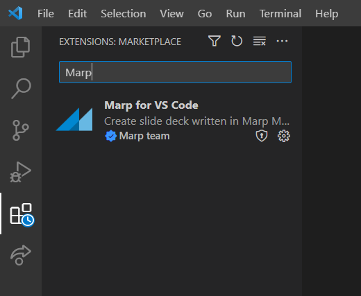
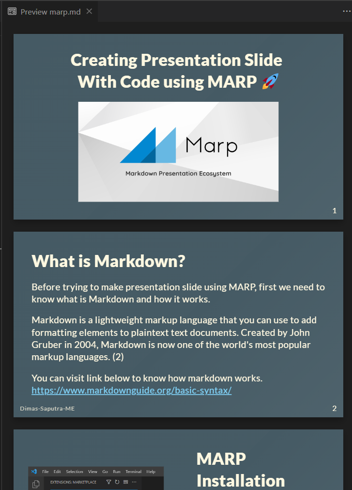

<!-- _class: lead invert --->
<!-- _footer: ㅤ --->
# Creating Presentation Slide </br> With Code using MARP :rocket:


---
# What is Markdown?

Before trying to make presentation slide using MARP, first we need to know what is Markdown and how it works.

Markdown is a lightweight markup language that you can use to add formatting elements to plaintext text documents. Created by John Gruber in 2004, Markdown is now one of the world's most popular markup languages. (2)

You can visit link below to know how markdown works.
https://www.markdownguide.org/basic-syntax/

---
# MARP Installation

There are two ways we can use MARP, first one by using Marp CLI and the second one by using Marp for VS Code. Head to the VS Code extension tab and install Marp for VS Code.

---
# Enable MARP in Markdown
```markdown
---
marp: true

---
```
Add this syntax at the start of your markdown code to enable MARP in your markdown. You can also add theme, header, footer, style, etc in MARP. You can view other MARP styling on their website or documentation.

---

# Marp Syntax
```markdown
---
marp: true
theme: [THEME]
class: [CLASS]
paginate: [TRUE / FALSE]
header: [HEADER]
footer: [FOOTER]
backgroundColor: [COLOR]
style: [STYLE]
transition: [TRANSITION]
...

---
```
---
# Marp Syntax
```markdown
<!-- _theme: [THEME] -->
<!-- _theme: [THEME] -->
<!-- _theme: [THEME] -->
```
You can also use this syntax to differentiate styling on each slide of your presentation slides


---
# Preview Slide

Press (CTRL+K V) or (CTRL+Shift+v) to open up slide preview tab

---
# Exporting
With MARP for VS Code you can export presentation slide with MARP icon in the right top corner of your VS Code markdown tab. MARP itself provides several export options:
* PowerPoint document
* PDF Slide Deck
* HTML Slide Deck
* PNG image (first slide only)
* JPEG image (first slide only)


---
<!-- _class: lead invert --->
# THANK YOU
### This Presentation was made <br> with MARP


---
<!-- _footer: Made by Dimas-Saputra-ME with MARP --->
# References

1. MARP
    1.1 https://marp.app/
    1.2 https://github.com/marp-team/marp
2. Markdown
    2.1 https://www.markdownguide.org/getting-started/
    2.2 https://www.markdownguide.org/basic-syntax/
3. Idea
    3.1 https://www.youtube.com/watch?v=EzQ-p41wNEE